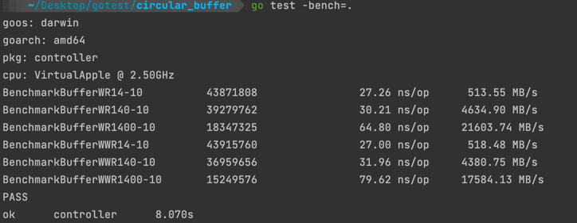

# Pakcet Buffer BenchMark

Tried the following ways to buffer the packets
- previous circular buffer
- slice
- golang chan to buffer packet
- linked list from "container/list"

Here are the results from the Macbook:

## circular buffer

## slice

## chan

## container/list

